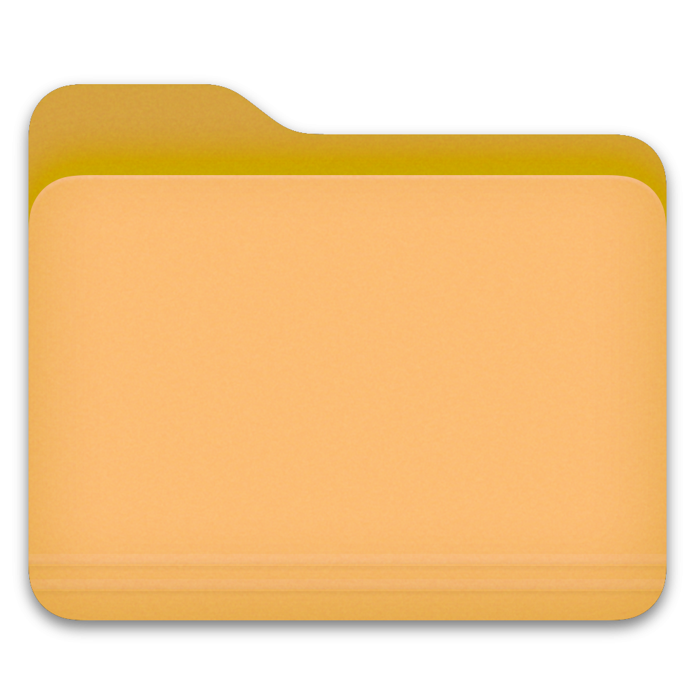

# Colorful icons for folders in Finder

To change the folder icon: 
- On this page right click the icon you want to use
- Select `Copy Image`
- In Finder right click the folder you want to change
- Select `Get Info`
- Select the small folder icon on top by clicking it
- Press Command-C (paste)
- Done

     